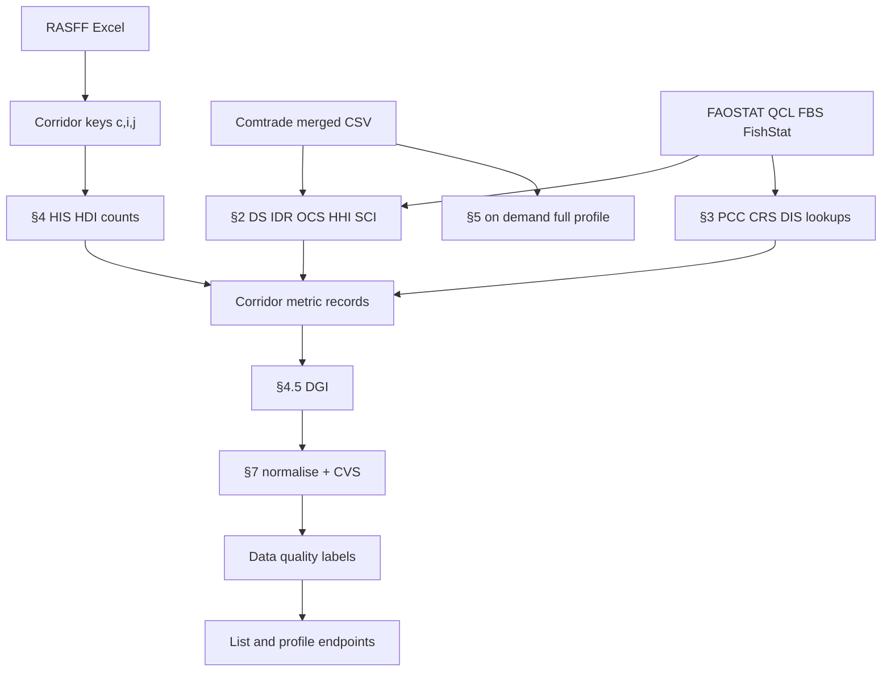

# Mathematical Framework — Implementation Reference

> **Math preview:** Equations use `$…$` (inline) and `$$…$$` (display). In VS Code / Cursor, enable **Markdown › Math: Enabled** (`markdown.math.enabled`) and open **Markdown Preview** (`Ctrl+Shift+V`). GitHub renders the same delimiters natively.

**Blueprint:** *Mathematical Framework: EU Food Fraud Vulnerability Intelligence System* v1.0 (February 2026)  
**Purpose:** Numbered equations as **actually computed** in DefenseFood today: Rust numerical core → Python orchestration → HTTP API → source data.  
**Audience:** Researchers and engineers who need the “what / how / why” without reading source trees.

---

## How to read this document

| Column | Meaning |
|--------|---------|
| **Eq.** | Equation number in the blueprint PDF |
| **Symbol** | Primary output name in API JSON |
| **Engine** | Where the numeric formula runs (always the Rust extension for scored quantities) |
| **When computed** | Startup batch vs on-demand per corridor |
| **Data** | External datasets and join assumptions |
| **API** | Where the value appears in the REST surface |
| **Status** | `Live` = populated in normal runs; `Partial` / `Planned` = caveats below |

**Corridor key everywhere:** $(c, i, j)$ = commodity HS $c$, destination (reporter) country $i$, origin (partner) country $j$, annual trade year $t$ for Comtrade/FAOSTAT; RASFF alert time uses month index $t_r$ as YYYYMM.

**Notation (blueprint §1):**

- $M(c,i,j,t)$ — bilateral imports (kg), Comtrade flow **M**, reporter = $i$, partner = $j$
- $M(c,i,\cdot,t)$ — total imports of $c$ into $i$
- $X(c,i,\cdot,t)$ — total exports of $c$ from $i$
- $P(c,i,t)$, $D(c,i,t)$ — production and domestic food-use supply (kg), FAOSTAT
- $R(c,i,j,t)$ — RASFF notification counts touching corridor $(c,i,j)$

---

## §1 — Notation and primary variables (no scored equations)

The blueprint’s §1 defines index sets and raw variables only. The running system materialises them as follows.

| Variable | Source | Role in pipeline |
|----------|--------|------------------|
| $M, X, V$ | UN Comtrade (annual, HS, all-partners preferred) | Section 2 denominators, Section 5 anomalies |
| $P, D, \Delta S$ | FAOSTAT QCL + Food Balance Sheets (+ FishStat for seafood $P$) | Eq (1)–(2), §3 PCC/CRS/DIS |
| RASFF rows | `updated_data_rasff_window.xlsx` | Defines which $(c,i,j)$ lanes exist; §4 hazard |
| Country codes | UN M49 via name lookup | Join RASFF text names to Comtrade numeric codes |

**Why two “destinations”:** RASFF *affected countries* (notifier, distribution, follow-up, attention) define alert lanes. Comtrade *reporter* is the importing market for trade statistics. The system **joins on the same $(c,i,j)$ key** but does not prove a specific alert batch ended in country $i$; structural metrics describe aggregate bilateral trade, not lot traceability.

---

## §2 — Commodity dependency models

**Purpose:** Quantify how much destination $i$ relies on origin $j$ for commodity $c$ in trade year $t$.  
**When computed:** Once at API startup for every RASFF-derived corridor, using the **latest Comtrade year** in the merged trade file.  
**Batch output fields:** `ds_prime`, `idr`, `ocs`, `bdi`, `hhi`, `sci`, `sci_norm`, `ssr`, `provenance`, `bilateral_import_kg`, `total_imports_kg`, `production_kg`, `idr_gt_1`.  
**API:** Corridor list, corridor profile, `/research/coverage`, dependency time-series on corridor detail.

**Trade aggregation rules (why numbers differ from raw Comtrade UI):**

1. Loads merged annual Comtrade with duplicate row collapse on $(\text{period}, \text{reporter}, \text{partner}, \text{HS}, \text{flow})$.
2. **HS rollup:** If the corridor HS exists exactly for reporter $i$, use only that code; otherwise sum **child** HS codes (longer prefixes) to avoid double-counting parent+child published together.
3. **HHI** uses the full partner mix at the chosen HS granularity (needs **all-partners** fetch, not RASFF-only bilateral pairs).
4. **FAOSTAT path:** When production or domestic supply exists for $(c,i,t)$, `provenance = faostat` and $\Delta S$ from stock variation may enter Eq (1). Otherwise **trade-only:** $P=0$, $D$ defaults to computed $DS^{\prime}$, `provenance = trade_only`.

---

### Eq (1) — Domestic supply (full balance)

$$
DS(c,i,t) = P(c,i,t) + M(c,i,\cdot,t) - X(c,i,\cdot,t) + \Delta S(c,i,t)
$$

| | |
|--|--|
| **Status** | **Live** when FAOSTAT stock variation is available; else Eq (2) |
| **Engine** | Rust `compute_supply_balance` with `delta_stocks_kg` |
| **Data** | FAOSTAT stock variation + Comtrade $M,X$ |

---

### Eq (2) — Apparent domestic supply ($DS^{\prime}$)

$$
DS^{\prime}(c,i,t) = P(c,i,t) + M(c,i,\cdot,t) - X(c,i,\cdot,t)
$$

| | |
|--|--|
| **Symbol** | `ds_prime` |
| **Engine** | Rust; returns **NaN** if $DS^{\prime} \le 0$ (lane excluded from SCI chain via `dependency_error`) |
| **Why** | Blueprint boundary: non-positive supply is a data-quality failure, not a score |
| **API** | Corridor `dependency` block; forensic “balance sheet” panel |

---

### Eq (3) — Import dependency ratio (IDR)

$$
IDR(c,i,t) = \frac{M(c,i,\cdot,t)}{DS^{\prime}(c,i,t)}
$$

| | |
|--|--|
| **Symbol** | `idr` |
| **Engine** | Rust `compute_idr` |
| **Interpretation** | $>1$ flagged `idr_gt_1` (re-export hub or missing $P$) |
| **Why it matters** | Measures national import reliance, not bilateral |

---

### Eq (4) — Origin country share (OCS)

$$
OCS(c,i,j,t) = \frac{M(c,i,j,t)}{M(c,i,\cdot,t)}
$$

| | |
|--|--|
| **Symbol** | `ocs` |
| **Engine** | Rust `compute_ocs` |
| **Requires** | $M(c,i,\cdot,t) > 0$; zero total imports → OCS/HHI/SCI absent (`zero_destination_imports` reason) |

---

### Eq (5) — Bilateral dependency index (BDI)

$$
BDI(c,i,j,t) = \frac{M(c,i,j,t)}{DS^{\prime}(c,i,t)}
$$

| | |
|--|--|
| **Symbol** | `bdi` |
| **Engine** | Rust `compute_bdi` |
| **Used in** | Network edge weight (Eq 32), ACEP, ORPS |

---

### Eq (6) — Decomposition (identity)

$$
BDI(c,i,j,t) = IDR(c,i,t) \times OCS(c,i,j,t)
$$

| | |
|--|--|
| **Status** | **Live** (algebraic; tested in engine) |
| **Why** | Separates “how import-dependent is the country” from “how much of that import is this origin” |

---

### Eq (7) — Herfindahl–Hirschman index (HHI)

$$
HHI(c,i,t) = \sum_{j \in \mathcal{O}} OCS(c,i,j,t)^2
$$

| | |
|--|--|
| **Symbol** | `hhi` |
| **Engine** | Rust `compute_hhi` on partner share vector |
| **Data** | All import partners for $(c,i,t)$ at resolved HS granularity |
| **Why** | Amplifies SCI when the import market is concentrated, not only when $j$ is large |

---

### Eq (8) — Self-sufficiency ratio (SSR)

$$
SSR(c,i,t) = \frac{P(c,i,t)}{D(c,i,t)}
$$

| | |
|--|--|
| **Symbol** | `ssr` |
| **Engine** | Rust `compute_ssr` |
| **$D$** | FAOSTAT domestic supply when available; else $DS^{\prime}$ proxy |
| **API** | Corridor dependency; not part of CVS |

---

### Eq (9) — Supply criticality index (SCI)

$$
SCI(c,i,j,t) = IDR(c,i,t) \cdot OCS(c,i,j,t) \cdot \bigl(1 + HHI(c,i,t)\bigr)
$$

| | |
|--|--|
| **Symbol** | `sci` (raw), `sci_norm = SCI/2` after percentile pass |
| **Engine** | Rust `compute_sci` / `compute_sci_normalised` |
| **Range** | Raw SCI $\in [0,2]$; norm $\in [0,1]$ |
| **Why $(1+HHI)$** | Single-origin dominance within a concentrated market increases corridor criticality |
| **CVS role** | `sci_norm` is mandatory for full composite score |

---

## §3 — Consumption demand modelling

**Purpose:** Demand-side exploitability — how culturally “sticky” consumption of $c$ is in country $i$.  
**When computed:** Startup lookups keyed by $(c, i)$ — **destination only** (not origin-specific).  
**Data:** FAOSTAT Food Balance Sheets (multi-year $D$) + population; FishStat does not drive §3.  
**API fields:** `pcc`, `crs`, `dis` on corridors; consumption block on full profile.

If FAOSTAT is missing, all three are absent and CVS uses the **SCI + HIS fallback** (`cvs_mode = sci_his`).

---

### Eq (10) — Per capita apparent consumption (PCC)

$$
PCC(c,i,t) = \frac{D(c,i,t)}{Pop(i,t)}
$$

| | |
|--|--|
| **Symbol** | `pcc` (kg/capita/year) |
| **Engine** | Rust `compute_pcc` |
| **Why** | Feeds ORPS (Eq 33); contextualises market size |

---

### Eq (11) — Commodity consumption rank score (CRS)

$$
CRS(c,i,t) = 1 - \frac{Rank(c,i,t)-1}{|C|-1}
$$

| | |
|--|--|
| **Symbol** | `crs`, then `crs_norm` at scoring |
| **Engine** | Rust `compute_crs_batch` after ranking all commodities in country $i$ by PCC descending |
| **Why rank not raw PCC** | Olive oil vs wheat live on different scales; rank is comparable across commodities |
| **CVS role** | When present, hybrid base uses `sci_norm × crs_norm` |

---

### Eq (12)–(13) — Demand inelasticity (DIS)

$$
\begin{aligned}
CV_D(c,i) &= \frac{\sigma_{PCC}}{\mu_{PCC}}
  \quad \text{over } \{t-5,\ldots,t\} \\
DIS(c,i) &= 1 - \min(CV_D,\, 1)
\end{aligned}
$$

| | |
|--|--|
| **Symbol** | `dis` |
| **Engine** | Rust `compute_dis` / `compute_cv` |
| **Window** | Five years ending at target FBS year; needs **≥3** PCC points |
| **Status** | **Live** on corridor record; **not** wired into CVS hybrid today |
| **Why** | Stable demand = fraud persists without consumer exit |

---

## §4 — Hazard signal modelling (RASFF integration)

**Purpose:** Turn RASFF alerts into time-decayed, severity-weighted lane signals and compare them to trade.  
**When computed:** Startup from extracted corridors → Rust notification objects.  
**Data:** RASFF Window Excel; hazard taxonomy parsed from `{category}` tokens in hazard text (six families).  
**API:** `his`, `hdi`, `hazard_breakdown`, `notification_count`, `severity_total`, `dgi`; hazard endpoints and notification lists per corridor.

---

### §4.1 — Corridor definition (structural, not a single equation)

For each notification $r$:

- Origin set $j \in Origin(r)$ (comma-separated in source data)
- Affected set $i \in \mathrm{Affected}(r) = \mathrm{notifying} \cup \mathrm{distribution} \cup \mathrm{followUp} \cup \mathrm{attention}$
- Commodity $c$ from HS column

**Implemented lanes:** Cartesian product $(c, i, j)$ with $i \neq j$; operator field excluded (FBO, not geography).

**Roles stored per lane:** `notifier`, `distribution`, `followUp`, `attention` → aggregated `destination_roles`, `role_counts`.

**Market presence label** (downstream filter, not in HIS formula):

| Label | Rule | Meaning |
|-------|------|---------|
| `confirmed` | distribution and/or followUp | Product is or may be on this market |
| `detected` | notifier only | Hazard detected; market presence not asserted |
| `informational` | attention only | Passive / transit-style mention |
| `unknown` | no roles | Defensive |

**API filter:** `active_only` drops `informational`-only destinations; `market_presence` filters list views. **HIS still counts all affected countries** in `affected_countries` unless you filter at query time.

---

### Eq (14) — Notification severity weight

$$
S(r) = W_{class}(r) \cdot W_{risk}(r) \in [0.1, 1.0]
$$

| Classification | $W_{class}$ |
|----------------|---------------|
| Alert notification | 1.0 |
| Border rejection | 0.8 |
| Information for follow-up | 0.7 |
| Information for attention | 0.5 |

| Risk decision | $W_{risk}$ |
|---------------|--------------|
| Serious | 1.0 |
| Potentially serious | 0.7 |
| Potential risk | 0.4 |
| Not serious | 0.2 |

| | |
|--|--|
| **Engine** | Rust `compute_severity` |
| **Why** | Recent border rejection ≠ passive information notice |

---

### Eq (15) — Hazard intensity score (HIS)

$$
HIS(c,i,j,t) = \sum_{r \in \mathcal{R}(c,i,j)} S(r) \cdot \alpha^{\,t - t_r}
$$

| | |
|--|--|
| **Symbol** | `his` → `his_norm` (log-percentile across corridors at scoring) |
| **Engine** | Rust `compute_his` |
| **$\mathcal{R}(c,i,j)$** | Notifications with matching HS, origin $j$, and $i \in$ `affected_countries` |
| **$t, t_r$** | YYYYMM month indices (not calendar-year subtraction) |
| **$\alpha$** | Default **0.90** (~6.6 month half-life, Eq 16) |
| **Why unbounded** | Many severe alerts should dominate; normalisation is deferred to §7 |

---

### Eq (16) — Half-life (diagnostic)

$$
t_{1/2} = \frac{-\ln 2}{\ln \alpha}
$$

| | |
|--|--|
| **Status** | **Live** in engine; exposed via research methodology metadata |
| **API** | Not on every corridor card |

---

### Eq (17)–(18) — Hazard diversity index (HDI)

$$
\begin{aligned}
HDI(c,i,j) &= -\sum_{h \in \mathcal{H}} p_h \ln p_h \\[4pt]
HDI_{\mathrm{norm}}(c,i,j) &= \frac{HDI}{\ln |\mathcal{H}|},
  \quad |\mathcal{H}| = 6
\end{aligned}
$$

| | |
|--|--|
| **Hazard families** | biological, chem_pesticides, chem_heavy_metals, chem_mycotoxins, chem_other, regulatory |
| **Symbol** | `hdi` (already normalised 0–1) |
| **Engine** | Rust `compute_hdi` |
| **Counting** | Multi-category alerts split fractional credit across categories for diversity |
| **Why** | Distinguishes single-issue recurrence from broad-spectrum failure |

---

### Eq (19) — Detection gap indicator (DGI)

$$
DGI(c,i,j,t) = \frac{M(c,i,j,t)}{M(c,i,\cdot,t)} - \frac{R(c,i,j,t)}{R(c,i,\cdot,t)} = OCS - R_{share}
$$

| | |
|--|--|
| **Symbol** | `dgi` |
| **Engine** | Rust `compute_dgi_from_counts` |
| **When** | Startup, only if bilateral and total imports **and** at least one destination notification exist |
| **Why** | Positive DGI + high BDI → high trade share, low alert share → possible under-inspection |
| **API** | Full corridor profile hazard block; not in CVS |

---

## §5 — Trade flow analysis

**Purpose:** Price, volume, mirror-reporting, and concentration **dynamics** from Comtrade.  
**When computed:** **On demand** when requesting a corridor **full profile** or **trade-anomalies** endpoint (not stored on the startup corridor list).  
**Period:** Latest year in trade file for levels; **prior year** for Δ metrics; **full history** for volume z-score.  
**API:** `trade_flow` object: `unit_value`, `z_uv`, `z_volume`, `z_volume_periods_available`, `z_volume_window_k`, `mtd`, `delta_hhi`, `delta_ocs`, `peer_unit_values`.

---

### Eq (20) — Unit value

$$
UV(c,i,j,t) = \frac{V(c,i,j,t)}{M(c,i,j,t)} \quad [\$/\text{kg}]
$$

| | |
|--|--|
| **Engine** | Rust `compute_unit_value` |
| **Data** | Comtrade `primaryValue`, `netWgt` summed per partner |

---

### Eq (21)–(22) — Cross-origin mean and std (peer basket)

$$
\mu_{UV}(c,i,t), \quad \sigma_{UV}(c,i,t)
$$

Computed across **all import partners** for $(c,i,t)$ at exact HS match in the on-demand pass.

---

### Eq (23) — Unit value z-score

$$
Z_{UV}(c,i,j,t) = \frac{UV_{ij} - \mu_{UV}}{\sigma_{UV}}
$$

| | |
|--|--|
| **Symbol** | `z_uv` |
| **Engine** | Rust batch z-score over partner UV vector |
| **Why** | Flags under- or over-pricing vs peer origins to same destination |

---

### Eq (24)–(26) — Volume anomaly (rolling)

$$
\begin{aligned}
\mu_M(c,i,j) &= \frac{1}{k}\sum_{\tau=t-k}^{t-1} M(c,i,j,\tau) \\[4pt]
\sigma_M(c,i,j) &= \text{std of the same window} \\[4pt]
Z_M(c,i,j,t) &= \frac{M(c,i,j,t) - \mu_M}{\sigma_M}
\end{aligned}
$$

| | |
|--|--|
| **Symbol** | `z_volume` |
| **Engine** | Rust `compute_volume_anomaly` with **$k=5$** |
| **Requires** | **≥ $k+1 = 6$** annual periods in bilateral series |
| **Status** | **Partial** until multi-year Comtrade (e.g. 2018–2023) merged |
| **UI** | “Needs longer trade history (≥6 periods; have *n*)” when NaN |

---

### Eq (27) — Mirror trade discrepancy (MTD)

$$
MTD(c,i,j,t) = \frac{\left|M_i(c,i,j,t) - X_j(c,j,i,t)\right|}{\max(M_i, X_j)}
$$

| | |
|--|--|
| **Symbol** | `mtd` |
| **Engine** | Rust `compute_mtd` |
| **$M_i$** | Reporter $i$ import flow M |
| **$X_j$** | Reporter $j$ export flow X to partner $i$ |
| **Why** | Persistent divergence suggests mis-reporting or transit fraud |

---

### Eq (28) — Concentration shift (ΔHHI)

$$
\Delta HHI(c,i,t) = HHI(c,i,t) - HHI(c,i,t-1)
$$

| | |
|--|--|
| **Symbol** | `delta_hhi` |
| **Engine** | Rust `compute_delta_hhi` |
| **Requires** | ≥2 annual periods in trade file |

---

### Eq (29) — Origin share shift (ΔOCS)

$$
\Delta OCS(c,i,j,t) = OCS(c,i,j,t) - OCS(c,i,j,t-1)
$$

| | |
|--|--|
| **Symbol** | `delta_ocs` |
| **Engine** | Rust `compute_delta_ocs` |
| **Why** | Detects origin switching / re-routing at lane level |

---

## §6 — Origin–attention country network

**Purpose:** Aggregate lane-level metrics to **country** views: inbound exposure (ACEP) and outbound propagation (ORPS).  
**When computed:** On request when calling country network endpoints (graph built from startup corridor metrics).  
**Graph:** Directed edges $j \to i$ per $(c,i,j)$ with weights below.

---

### Eq (30)–(32) — Edge weights

$$
w_{trade} = M(c,i,j,t), \quad w_{hazard} = HIS(c,i,j,t), \quad w_{dep} = BDI(c,i,j,t)
$$

| | |
|--|--|
| **Storage** | Exposure network edge payload |
| **BDI missing** | Edge contributes **0** dependency weight (not severity proxy) |
| **Role** | RASFF `market_presence` stored per edge |

---

### Eq (33) — Origin risk propagation score (ORPS)

$$
ORPS(j,c,t) = \sum_{i \in \mathcal{N}} BDI(c,i,j,t) \cdot HIS(c,i,j,t) \cdot PCC(c,i,t)
$$

| | |
|--|--|
| **API** | `GET /api/v1/countries/{m49}/orps-by-commodity` |
| **Default sum** | **`confirmed` edges only** (distribution/followUp market presence) |
| **Variant** | Role-split buckets (`confirmed`, `detected`, `informational`, `unknown`) |
| **Why filter** | Avoid inflating ORPS with transit-only attention mentions |

---

### Eq (34) — Attention country exposure profile (ACEP)

$$
ACEP(i,t) = \sum_{c,j} BDI(c,i,j,t) \cdot HIS(c,i,j,t) \cdot CRS(c,i,t)
$$

| | |
|--|--|
| **API** | `GET /api/v1/countries/{m49}/acep`, exposure profile |
| **Default sum** | **`confirmed` inbound edges only** |
| **Why CRS not PCC** | Inbound profile weights commodities important **in the destination diet** |

---

### Eq (35) — Empirical hazard probability

$$
\hat P(\text{hazard} \mid c,i,j) = \frac{R(c,i,j,T)}{M(c,i,j,T) / \bar m(c)}
$$

| | |
|--|--|
| **Status** | **Planned** — implemented in Rust engine, **not** exposed in API or dashboard |
| **Why deferred** | Needs shipment-size prior and long RASFF history thresholds per blueprint |

---

## §7 — Composite vulnerability scoring

**Purpose:** Rank lanes for inspection priority.  
**When computed:** API startup immediately after dependency + hazard enrichment.  
**API:** `cvs`, `cvs_mode`, `cvs_hazard_only`, `cvs_missing_inputs`, `sci_norm`, `his_norm`, `crs_norm`; `POST /api/v1/scores/recalculate` with config; data-quality labels after scoring.

---

### Eq (36) — Min–max normalisation

$$
x_{norm} = \frac{x - x_{min}}{x_{max} - x_{min}}
$$

| | |
|--|--|
| **Status** | **Live** as optional `ScoringConfig.normalisation_method = min_max` |
| **Default** | Percentile rank (Eq 37) |

---

### Eq (37) — Percentile rank normalisation

$$
x_{norm} = \text{rank}(x) / (N-1)
$$

| | |
|--|--|
| **Applied to** | `sci`, `crs` (and `his` if not using log variant) |
| **Why default** | Robust to skewed corridor distributions |

---

### Eq (38) — Log-percentile normalisation

$$
x_{\mathrm{norm}} = \mathrm{percentile\_rank}\bigl(\ln(1+x)\bigr)
$$

| | |
|--|--|
| **Applied to** | **`his` always** (blueprint recommendation for exponential alert counts) |
| **Why** | Prevents a few hyper-active lanes from compressing everyone else |

---

### Eq (39) — Weighted linear CVS (optional)

$$
CVS = \sum_k w_k x_{k,norm}, \quad \sum w_k = 1
$$

| | |
|--|--|
| **Status** | **Live** if `composition_method = weighted_linear` |
| **Components** | Available norms only (SCI, HIS, CRS when present) |

---

### Eq (40) — Geometric mean CVS (optional)

$$
CVS = \prod_k x_{k,norm}^{w_k}
$$

| | |
|--|--|
| **Status** | **Live** if `composition_method = geometric_mean` |
| **Why** | Any zero component drives CVS to zero (conservative) |

---

### Eq (41) — Hybrid CVS (default)

$$
\begin{aligned}
CVS_{\mathrm{raw}} &= SCI_{\mathrm{norm}} \cdot CRS_{\mathrm{norm}} \\
  &\quad \cdot \bigl(1 + w_h HIS_{\mathrm{norm}} + w_p PAS_{\mathrm{norm}} + w_{sc} SCCS_{\mathrm{norm}}\bigr) \\[4pt]
CVS &= \frac{CVS_{\mathrm{raw}}}{1 + w_h + w_p + w_{sc}} \in [0,1]
\end{aligned}
$$

| | |
|--|--|
| **Default weights** | $w_h = w_p = w_{sc} = 1$ |
| **PAS / SCCS** | **Not populated** — treated as **0** (amplifier reduces to $1 + w_h HIS_{norm}$) |
| **Fallback without CRS** | `cvs_mode = sci_his`: base $SCI_{norm}$, amplifier $1 + w_h HIS_{norm}$, same rescaling |
| **Missing SCI or HIS** | `cvs = null`; `cvs_hazard_only = his_norm` for hazard-only display |
| **Why hybrid** | Structural base × demand gate; alerts amplify but cannot invent dependency from thin air |

**Data-quality annotations (post-score):** `sci_unavailable_reason`, `data_quality` (`full` | `hazard_only` | …) explain empty SCI/CVS on list and forensic views.

---

## End-to-end computation order (startup)

---

## API surface map (by section)

| Section | Primary endpoints |
|---------|-------------------|
| §2–§4 + §7 | `GET /api/v1/corridors`, `.../top`, `.../{hs}/{dest}/{origin}`, `.../full` |
| §4 detail | `.../hazard`, `.../notifications` |
| §5 | `.../full` (`trade_flow`), `.../trade-anomalies`, `.../time-series` |
| §3 | Fields on corridor; consumption block in `.../full` |
| §6 | `GET /api/v1/network/graph`, `.../origins`, `GET /api/v1/countries/{m49}/acep`, `.../orps-by-commodity` |
| Research | `GET /api/v1/research/coverage`, `.../methodology`, `.../distributions/{metric}` |
| Config | `GET/POST /api/v1/scores/config`, `.../recalculate` |

---

## Implementation gaps vs blueprint (honest checklist)

| Blueprint item | Status |
|----------------|--------|
| Eq (35) hazard probability | Engine only; no API |
| PAS, SCCS in Eq (41) | Weights exist; inputs always zero |
| DIS in composite | Computed; not in CVS |
| §5 on corridor list | On-demand only (full profile) |
| RASFF month vs Comtrade year | Hazard decay uses YYYYMM; trade uses latest **annual** period |
| Final destination proof | Not modelled; `market_presence` mitigates network sums only |
| 6+ years Comtrade | Required for Eq (24)–(26) on most lanes |

---

## Data prerequisites (operational)

| Need | For |
|------|-----|
| `updated_data_rasff_window.xlsx` | All §4 lanes and HIS |
| `merged_trade_data.csv` (all-partners years merged) | §2 OCS/HHI, §5, DGI |
| FAOSTAT QCL + FBS under `backend/data/faostat/` | $DS^{\prime}$, SSR, §3, seafood P via FishStat |
| ≥6 Comtrade years per lane | Volume anomaly $Z_M$ |

---

*Document version: aligned to DefenseFood codebase as of implementation review. Equation numbers follow blueprint v1.0 (February 2026).*
