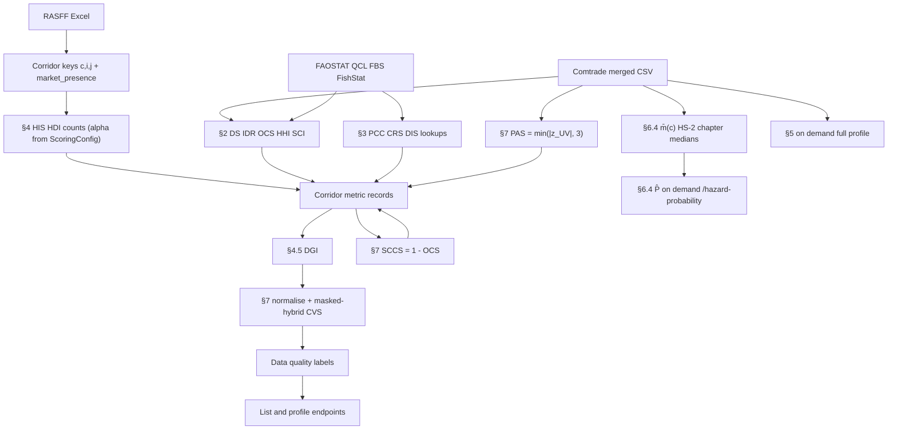

# Mathematical Framework: Implementation Reference

This document maps the blueprint *Mathematical Framework: EU Food Fraud Vulnerability Intelligence System* (v1.0, February 2026) to the DefenceFood implementation. Each numbered equation is stated as in the framework, then related to the data sources, computation path (Rust numerical core, Python orchestration, REST API), and deployment status in the current build.

The tables below use the following columns where a metric is discussed in detail:

| Column | Meaning |
|--------|---------|
| **Eq.** | Equation number in the blueprint |
| **Symbol** | Field name in the API response |
| **Engine** | Rust function that evaluates the expression |
| **When computed** | Startup batch versus on-demand evaluation |
| **Data** | External datasets and join assumptions |
| **API** | Endpoints that expose the quantity |
| **Status** | Implemented (`Live`), partial, or planned |

Symbols are defined before use. In running text, the subscripts $(c,i,j,t)$ are often suppressed when the corridor context is already fixed.

---

## Symbols and abbreviations

### Subscripts and indices

| Symbol | Meaning |
|--------|---------|
| $c$ | **Commodity:** HS code on the lane (RASFF `hs_code`, Comtrade `cmdCode`) |
| $i$ | **Destination country:** importing or “attention” market (Comtrade reporter; RASFF affected country) |
| $j$ | **Origin country:** exporting / RASFF **origin** (Comtrade **partner**) |
| $t$ | **Trade / supply year:** annual Comtrade `period` and FAOSTAT year used for §2–§3 |
| $t_r$ | **Notification month:** RASFF alert date as YYYYMM (used in HIS decay) |
| $r$ | A single **RASFF notification** (one row in the alert database) |
| $h$ | **Hazard type:** one of six taxonomy families in $\mathcal{H}$ |
| $\cdot$ | **Sum over all partners:** e.g. $M(c,i,\cdot,t) = \sum_j M(c,i,j,t)$ |
| $\mathcal{O}$ | Set of **import partner** countries for destination $i$ |
| $\mathcal{N}$ | Set of **destination** countries in scope (EU members in ORPS sums) |
| $\mathcal{H}$ | Set of **six hazard families** (biological, pesticides, heavy metals, mycotoxins, other chemical, regulatory) |
| $\mathcal{R}(c,i,j)$ | Set of RASFF notifications that touch corridor $(c,i,j)$ |

A **corridor** is the lane $(c, i, j)$: one commodity, one destination country, and one origin country. The API persists one metric record per corridor, together with RASFF role metadata where applicable.

---

### Raw data variables (inputs)

#### UN Comtrade (trade flows)

| Symbol | What it is | Units / field |
|--------|------------|---------------|
| $M(c,i,j,t)$ | **Bilateral import quantity:** what country $i$ reports importing commodity $c$ from origin $j$ in year $t$ | kg (`netWgt`), flow **M** (imports) |
| $M(c,i,\cdot,t)$ | **Total imports** of $c$ into $i$ from all origins in year $t$ | kg; sum over partners |
| $X(c,i,\cdot,t)$ | **Total exports** of $c$ from country $i$ in year $t$ | kg, flow **X** (exports) |
| $X_j(c,j,i,t)$ | **Mirror export:** what origin $j$ reports exporting to destination $i$ (used in MTD) | kg |
| $V(c,i,j,t)$ | **Bilateral import value:** USD value of the same flow as $M$ | USD (`primaryValue`) |
| $UV(c,i,j,t)$ | **Unit value:** price proxy $V / M$ | USD/kg |

#### FAOSTAT / FishStat (production and consumption)

| Symbol | What it is | Units / source |
|--------|------------|---------------|
| $P(c,i,t)$ | **Domestic production** of commodity $c$ in country $i$ | kg from QCL or FishStat (seafood) |
| $D(c,i,t)$ | **Domestic supply for food use** (apparent consumption quantity) | kg from Food Balance Sheets |
| $\Delta S(c,i,t)$ | **Stock change:** draw-down positive, build-up negative | kg from FBS when available; otherwise 0 |
| $Pop(i,t)$ | **Population** of country $i$ | persons (for PCC) |

#### RASFF Window (hazard alerts)

| Symbol | What it is | How built in the system |
|--------|------------|-------------------------|
| $R(c,i,j,t)$ | **Notification count** for corridor $(c,i,j)$ in period $t$ | Count of alerts with matching HS, origin $j$, and $i$ in affected countries |
| $R(c,i,\cdot,t)$ | **Total notifications** for commodity $c$ and destination $i$ (all origins) | Denominator for notification share in DGI |
| $S(r)$ | **Severity weight** of notification $r$ | $W_{\mathrm{class}} \times W_{\mathrm{risk}}$ (Eq 14) |
| $W_{\mathrm{class}}(r)$ | **Classification weight:** alert vs border rejection vs information | See Eq (14) table |
| $W_{\mathrm{risk}}(r)$ | **Risk-decision weight:** serious vs not serious | See Eq (14) table |
| $\alpha$ | **Temporal decay** for HIS; default **0.90** | Older alerts count less |

---

### Section 2: Dependency metrics (symbols and API names)

| Symbol | Name (abbr.) | What it measures |
|--------|--------------|------------------|
| $DS(c,i,t)$ | Domestic supply | Full balance sheet including $\Delta S$ when available |
| $DS'(c,i,t)$ | Apparent domestic supply (**DS′**) | $P + M - X$ (+ $\Delta S$ when in Eq 1 path); API: `ds_prime` |
| $IDR(c,i,t)$ | Import dependency ratio | Share of supply met by imports: $M_{\cdot} / DS'$; API: `idr` |
| $OCS(c,i,j,t)$ | Origin country share | Origin $j$’s share of total imports: $M_{ij} / M_{\cdot}$; API: `ocs` |
| $BDI(c,i,j,t)$ | Bilateral dependency index | Origin $j$’s share of **domestic supply**: $M_{ij} / DS'$; API: `bdi` |
| $HHI(c,i,t)$ | Herfindahl–Hirschman index | Concentration of import partners: $\sum_j OCS_{ij}^2$; API: `hhi` |
| $SSR(c,i,t)$ | Self-sufficiency ratio | $P / D$; API: `ssr` |
| $SCI(c,i,j,t)$ | Supply criticality index | $IDR \times OCS \times (1 + HHI)$; API: `sci`, `sci_norm` |

---

### Section 3: Consumption metrics

| Symbol | Name (abbr.) | What it measures |
|--------|--------------|------------------|
| $PCC(c,i,t)$ | Per capita consumption | $D / Pop$ (kg/capita/year); API: `pcc` |
| $CRS(c,i,t)$ | Consumption rank score | Rank of $c$ within country $i$ by PCC (0–1); API: `crs`, `crs_norm` |
| $|C|$ | Commodity count | Number of commodities ranked in country $i$ for CRS |
| $CV_D(c,i)$ | Coefficient of variation of PCC | Volatility of per-capita consumption over ~5 years |
| $DIS(c,i)$ | Demand inelasticity score | $1 - \min(CV_D, 1)$; API: `dis` |

---

### Section 4: Hazard metrics

| Symbol | Name (abbr.) | What it measures |
|--------|--------------|------------------|
| $HIS(c,i,j,t)$ | Hazard intensity score | Severity-weighted, decayed sum of alerts; API: `his`, `his_norm` |
| $HDI(c,i,j)$ | Hazard diversity index | Normalised entropy across hazard types; API: `hdi` |
| $p_h$ | Hazard-type proportion | Share of lane alerts in category $h$ |
| $DGI(c,i,j,t)$ | Detection gap indicator | Trade share minus notification share; API: `dgi` |

---

### Section 5: Trade-flow anomaly metrics

| Symbol | Name (abbr.) | What it measures |
|--------|--------------|------------------|
| $\mu_{UV}, \sigma_{UV}$ | Mean / std of unit values | Across all import partners to $i$ for $c$ |
| $Z_{UV}(c,i,j,t)$ | Unit-value z-score | How unusual this origin’s price is vs peers; API: `z_uv` |
| $\mu_M, \sigma_M$ | Rolling mean / std of volume | On corridor $(c,i,j)$ history (window $k$) |
| $Z_M(c,i,j,t)$ | Volume anomaly z-score | Surge or collapse vs own history; API: `z_volume` |
| $k$ | Rolling window length | Default **5** prior years |
| $MTD(c,i,j,t)$ | Mirror trade discrepancy | Importer vs exporter report gap; API: `mtd` |
| $\Delta HHI(c,i,t)$ | Change in HHI | Year-on-year concentration shift; API: `delta_hhi` |
| $\Delta OCS(c,i,j,t)$ | Change in OCS | Year-on-year origin share shift; API: `delta_ocs` |

---

### Section 6: Network aggregates

| Symbol | Name (abbr.) | What it measures |
|--------|--------------|------------------|
| $w_{\mathrm{trade}}$ | Trade edge weight | Bilateral import kg on graph edge $j \to i$ |
| $w_{\mathrm{hazard}}$ | Hazard edge weight | HIS on that edge |
| $w_{\mathrm{dep}}$ | Dependency edge weight | BDI on that edge |
| $ORPS(j,c,t)$ | Origin risk propagation score | Outbound hazard × dependency × PCC; API: `orps`, `orps_by_role` |
| $ACEP(i,t)$ | Attention country exposure profile | Inbound hazard × dependency × CRS; API: `acep`, `acep_by_role` |
| $\hat P(\mathrm{hazard}\mid c,i,j)$ | Empirical hazard probability | Alerts per estimated shipment (Eq 35); API: `p_hat` on `/hazard-probability` |
| $\bar m(c)$ | Average shipment size, by HS-2 chapter | Median Comtrade `netWgt` per row; used in Eq 35 |

---

### Section 7: Composite scoring

| Symbol | Name (abbr.) | What it measures |
|--------|--------------|------------------|
| $x_{\mathrm{norm}}$ | Normalised score | Percentile (or min–max / log-percentile) rank in $[0,1]$ |
| $CVS$ | Composite vulnerability score | Lane priority 0–1; API: `cvs`, `cvs_amplifier_terms` |
| $w_h, w_p, w_{sc}$ | Amplifier weights | Hazard, price-anomaly (PAS), supply-chain (SCCS); default 1 each |
| $PAS$ | Price anomaly score | $\min(\lvert z_{UV}\rvert, 3)$ per lane; API: `pas`, `pas_norm` |
| $SCCS$ | Supply-chain complexity score | $1 - OCS$ per lane; API: `sccs`, `sccs_norm` |

---

### Greek letters and statistics (used in formulas)

| Symbol | Meaning |
|--------|---------|
| $\alpha$ | Monthly decay base for HIS ($\alpha^{t - t_r}$) |
| $\mu$ | Mean (e.g. $\mu_{UV}$, $\mu_M$ rolling mean) |
| $\sigma$ | Standard deviation |
| $\sigma_{PCC}$ | Std. dev. of per-capita consumption time series |
| $\ln$ | Natural logarithm (HDI entropy, log-percentile norm) |

---

## Section 1: Notation and primary variables

Section 1 of the blueprint specifies index sets and raw variables only. The glossary above gives the operational definitions used in software. At application startup the following sources are loaded:

| Data | Role in pipeline |
|------|------------------|
| Comtrade merged CSV | Supplies $M$, $X$, and $V$ for Sections 2, 5, and DGI |
| FAOSTAT QCL and FBS (FishStat for seafood $P$) | Supplies $P$, $D$, $\Delta S$, and $Pop$ for Sections 2 and 3 |
| RASFF Excel | Defines corridors; supplies $R$ and $S(r)$ for Section 4 |
| UN M49 name lookup | Aligns RASFF country names with Comtrade numeric codes |

RASFF *affected countries* (notifier, distribution, follow-up, attention) define alert lanes, whereas Comtrade *reporter* denotes the importing market in trade statistics. The implementation joins RASFF and Comtrade on the common key $(c,i,j)$. That join supports structural inference on bilateral trade; it does not establish the final destination of a particular notified lot.

---

## Section 2: Commodity dependency models

Section 2 quantifies the reliance of destination $i$ on origin $j$ for commodity $c$ in trade year $t$. Metrics are computed once at API startup for each RASFF-derived corridor, using the latest annual year present in the merged Comtrade file. Batch fields include `ds_prime`, `idr`, `ocs`, `bdi`, `hhi`, `sci`, `sci_norm`, `ssr`, `provenance`, `bilateral_import_kg`, `total_imports_kg`, `production_kg`, and `idr_gt_1`. They are exposed on the corridor list, corridor profile, `/research/coverage`, and the dependency time-series on the lane report.

**Trade aggregation** (differences from raw Comtrade extracts):

1. Loads merged annual Comtrade with duplicate row collapse on $(\text{period}, \text{reporter}, \text{partner}, \text{HS}, \text{flow})$.
2. **HS rollup:** If the corridor HS exists exactly for reporter $i$, use only that code; otherwise sum **child** HS codes (longer prefixes) to avoid double-counting parent+child published together.
3. **HHI** uses the full partner mix at the chosen HS granularity (needs **all-partners** fetch, not RASFF-only bilateral pairs).
4. **FAOSTAT path:** When production or domestic supply exists for $(c,i,t)$, `provenance = faostat` and $\Delta S$ from stock variation may enter Eq (1). Otherwise **trade-only:** $P=0$, $D$ defaults to computed $DS^{\prime}$, `provenance = trade_only`.

---

### Equation (1). Domestic supply (full balance)

$$
DS(c,i,t) = P(c,i,t) + M(c,i,\cdot,t) - X(c,i,\cdot,t) + \Delta S(c,i,t)
$$

| | |
|--|--|
| **Status** | **Live** when FAOSTAT stock variation is available; else Eq (2) |
| **Engine** | Rust `compute_supply_balance` with `delta_stocks_kg` |
| **Data** | FAOSTAT stock variation + Comtrade $M,X$ |

---

### Equation (2). Apparent domestic supply ($DS^{\prime}$)

$$
DS^{\prime}(c,i,t) = P(c,i,t) + M(c,i,\cdot,t) - X(c,i,\cdot,t)
$$

| | |
|--|--|
| **Symbol** | `ds_prime` |
| **Engine** | Rust; returns **NaN** if $DS^{\prime} \le 0$ (lane excluded from SCI chain via `dependency_error`) |
| **Interpretation** | Non-positive apparent supply is treated as a data-quality failure; the lane is excluded from the SCI chain rather than assigned a score |
| **API** | Corridor `dependency` block; forensic “balance sheet” panel |

---

### Equation (3). Import dependency ratio (IDR)

$$
IDR(c,i,t) = \frac{M(c,i,\cdot,t)}{DS^{\prime}(c,i,t)}
$$

| | |
|--|--|
| **Symbol** | `idr` |
| **Engine** | Rust `compute_idr` |
| **Interpretation** | Measures national import reliance (not bilateral). Values above 1 are flagged `idr_gt_1`, consistent with a re-export hub or missing production data |

---

### Equation (4). Origin country share (OCS)

$$
OCS(c,i,j,t) = \frac{M(c,i,j,t)}{M(c,i,\cdot,t)}
$$

| | |
|--|--|
| **Symbol** | `ocs` |
| **Engine** | Rust `compute_ocs` |
| **Requires** | $M(c,i,\cdot,t) > 0$; zero total imports; OCS/HHI/SCI absent (`zero_destination_imports` reason) |

---

### Equation (5). Bilateral dependency index (BDI)

$$
BDI(c,i,j,t) = \frac{M(c,i,j,t)}{DS^{\prime}(c,i,t)}
$$

| | |
|--|--|
| **Symbol** | `bdi` |
| **Engine** | Rust `compute_bdi` |
| **Used in** | Network edge weight (Eq 32), ACEP, ORPS |

---

### Equation (6). Decomposition (identity)

$$
BDI(c,i,j,t) = IDR(c,i,t) \times OCS(c,i,j,t)
$$

| | |
|--|--|
| **Status** | **Live** (algebraic; tested in engine) |
| **Interpretation** | BDI factorises into national import reliance (IDR) and bilateral share within imports (OCS) |

---

### Equation (7). Herfindahl–Hirschman index (HHI)

$$
HHI(c,i,t) = \sum_{j \in \mathcal{O}} OCS(c,i,j,t)^2
$$

| | |
|--|--|
| **Symbol** | `hhi` |
| **Engine** | Rust `compute_hhi` on partner share vector |
| **Data** | All import partners for $(c,i,t)$ at resolved HS granularity |
| **Interpretation** | HHI amplifies SCI when the partner mix is concentrated, not only when origin $j$ holds a large bilateral share |

---

### Equation (8). Self-sufficiency ratio (SSR)

$$
SSR(c,i,t) = \frac{P(c,i,t)}{D(c,i,t)}
$$

| | |
|--|--|
| **Symbol** | `ssr` |
| **Engine** | Rust `compute_ssr` |
| **$D$** | FAOSTAT domestic supply when available; else $DS^{\prime}$ proxy |
| **API** | Corridor dependency; not part of CVS |

---

### Equation (9). Supply criticality index (SCI)

$$
SCI(c,i,j,t) = IDR(c,i,t) \cdot OCS(c,i,j,t) \cdot \bigl(1 + HHI(c,i,t)\bigr)
$$

| | |
|--|--|
| **Symbol** | `sci` (raw), `sci_norm` (Section 7 percentile rank across corpus) |
| **Engine** | Rust `compute_sci`; `compute_sci_normalised` (= SCI/2) is computed during dependency enrichment but is **overwritten by Section 7 percentile rank** before the API returns it |
| **Range** | Raw SCI $\in [0,2]$; norm $\in [0,1]$ |
| **Interpretation** | The factor $(1+\mathrm{HHI})$ increases corridor criticality when a concentrated import market is dominated by a single origin |
| **CVS role** | `sci_norm` is mandatory for full composite score |

---

## Section 3: Consumption demand modelling

Section 3 addresses demand-side exploitability: the extent to which consumption of commodity $c$ in country $i$ is culturally entrenched and therefore difficult to displace. Lookups are built at startup and keyed by $(c,i)$ at the destination only (not by origin). Inputs are drawn from FAOSTAT Food Balance Sheets (multi-year $D$) and population; FishStat does not enter this section. The API exposes `pcc`, `crs`, and `dis` on corridor records and in the consumption block of the full lane profile.

When FAOSTAT is unavailable, these quantities are omitted and the composite score falls back to the SCI and HIS formulation (`cvs_mode = sci_his`).

---

### Equation (10). Per capita apparent consumption (PCC)

$$
PCC(c,i,t) = \frac{D(c,i,t)}{Pop(i,t)}
$$

| | |
|--|--|
| **Symbol** | `pcc` (kg/capita/year) |
| **Engine** | Rust `compute_pcc` |
| **Interpretation** | PCC enters ORPS (Equation 33) and scales hazard-weighted dependency by market size |

---

### Equation (11). Commodity consumption rank score (CRS)

$$
CRS(c,i,t) = 1 - \frac{Rank(c,i,t)-1}{|C|-1}
$$

| | |
|--|--|
| **Symbol** | `crs`, then `crs_norm` at scoring |
| **Engine** | Rust `compute_crs_batch` after ranking all commodities in country $i$ by PCC descending |
| **Interpretation** | Ranking PCC within the destination makes commodities comparable when absolute per-capita levels differ widely |
| **CVS role** | When present, hybrid base uses `sci_norm × crs_norm` |

---

### Equations (12)–(13). Demand inelasticity (DIS)

$$
\begin{aligned}
CV_D(c,i) &= \frac{\sigma_{PCC}}{\mu_{PCC}}
  \quad \text{over } \{t-5,\ldots,t\} \\
DIS(c,i) &= 1 - \min(CV_D,\, 1)
\end{aligned}
$$

| | |
|--|--|
| **Symbol** | `dis` |
| **Engine** | Rust `compute_dis` / `compute_cv` |
| **Window** | Five years ending at target FBS year; needs **≥3** PCC points |
| **Status** | **Live** on corridor record; **not** wired into CVS hybrid today |
| **Interpretation** | Low coefficient of variation in PCC indicates inelastic demand, which the blueprint associates with persistent fraud exposure |

---

## Section 4: Hazard signal modelling (RASFF integration)

Section 4 transforms RASFF alerts into time-decayed, severity-weighted lane-level signals and compares them with trade volumes. Computation runs at startup on corridors extracted from the RASFF Window workbook; notifications are represented as Rust objects for the hazard engine. Hazard categories are parsed from `{category}` tokens in the hazard text (six families). The API returns `his`, `hdi`, `hazard_breakdown`, `notification_count`, `severity_total`, and `dgi`, with additional hazard and notification endpoints per corridor.

---

### Section 4.1: Corridor definition (structural, not a single equation)

For each notification $r$:

- Origin set $j \in Origin(r)$ (comma-separated in source data)
- Affected set $i \in \mathrm{Affected}(r) = \mathrm{notifying} \cup \mathrm{distribution} \cup \mathrm{followUp} \cup \mathrm{attention}$
- Commodity $c$ from HS column

**Implemented lanes:** Cartesian product $(c, i, j)$ with $i \neq j$; operator field excluded (FBO, not geography).

**Roles stored per lane:** `notifier`, `distribution`, `followUp`, `attention`; aggregated `destination_roles`, `role_counts`.

**Market presence label** (downstream filter, not in HIS formula):

| Label | Rule | Meaning |
|-------|------|---------|
| `confirmed` | distribution and/or followUp | Product is or may be on this market |
| `detected` | notifier only | Hazard detected; market presence not asserted |
| `informational` | attention only | Passive / transit-style mention |
| `unknown` | no roles | Defensive |

**API filter:** `active_only` drops `informational`-only destinations; `market_presence` filters list views. **HIS still counts all affected countries** in `affected_countries` unless you filter at query time.

---

### Equation (14). Notification severity weight

$$
S(r) = W_{class}(r) \cdot W_{risk}(r) \in [0.1, 1.0]
$$

| Classification | $W_{class}$ |
|----------------|---------------|
| Alert notification | 1.0 |
| Border rejection | 0.8 |
| Information for follow-up | 0.7 |
| Information for attention | 0.5 |

| Risk decision | $W_{risk}$ |
|---------------|--------------|
| Serious | 1.0 |
| Potentially serious | 0.7 |
| Potential risk | 0.4 |
| Not serious | 0.2 |

| | |
|--|--|
| **Engine** | Rust `compute_severity` |
| **Interpretation** | Border rejections receive higher classification weight than passive information notices |

---

### Equation (15). Hazard intensity score (HIS)

$$
HIS(c,i,j,t) = \sum_{r \in \mathcal{R}(c,i,j)} S(r) \cdot \alpha^{\,t - t_r}
$$

| | |
|--|--|
| **Symbol** | `his`; `his_norm` (log-percentile across corridors at scoring) |
| **Engine** | Rust `compute_his` |
| **$\mathcal{R}(c,i,j)$** | Notifications with matching HS, origin $j$, and $i \in$ `affected_countries` |
| **$t, t_r$** | YYYYMM month indices (not calendar-year subtraction) |
| **$\alpha$** | Default **0.90** (~6.6 month half-life, Eq 16) |
| **Interpretation** | HIS is left unbounded so multiple severe alerts can dominate; normalisation is applied in Section 7 |

---

### Equation (16). Half-life (diagnostic)

$$
t_{1/2} = \frac{-\ln 2}{\ln \alpha}
$$

| | |
|--|--|
| **Status** | **Live** in engine; exposed via research methodology metadata |
| **API** | Not on every corridor card |

---

### Equations (17)–(18). Hazard diversity index (HDI)

$$
\begin{aligned}
HDI(c,i,j) &= -\sum_{h \in \mathcal{H}} p_h \ln p_h \\[4pt]
HDI_{\mathrm{norm}}(c,i,j) &= \frac{HDI}{\ln |\mathcal{H}|},
  \quad |\mathcal{H}| = 6
\end{aligned}
$$

| | |
|--|--|
| **Hazard families** | biological, chem_pesticides, chem_heavy_metals, chem_mycotoxins, chem_other, regulatory |
| **Symbol** | `hdi` (already normalised 0–1) |
| **Engine** | Rust `compute_hdi` |
| **Counting** | Multi-category alerts split fractional credit across categories for diversity |
| **Interpretation** | HDI distinguishes repeated single-hazard events from diversified hazard portfolios |

---

### Equation (19). Detection gap indicator (DGI)

$$
DGI(c,i,j,t) = \frac{M(c,i,j,t)}{M(c,i,\cdot,t)} - \frac{R(c,i,j,t)}{R(c,i,\cdot,t)} = OCS - R_{share}
$$

| | |
|--|--|
| **Symbol** | `dgi` |
| **Engine** | Rust `compute_dgi_from_counts` |
| **When** | Startup, only if bilateral and total imports **and** at least one destination notification exist |
| **Interpretation** | Positive DGI together with high BDI indicates a large trade share relative to alert share, consistent with possible under-inspection |
| **API** | Full corridor profile hazard block; not in CVS |

---

## Section 5: Trade flow analysis

Section 5 derives price, volume, mirror-reporting, and concentration dynamics from Comtrade. These quantities are evaluated on demand when a corridor full profile or trade-anomalies endpoint is requested; they are not stored on the startup corridor list. Levels use the latest year in the trade file; year-on-year changes use the prior year; the volume z-score draws on the full bilateral history. Results appear under `trade_flow` (`unit_value`, `z_uv`, `z_volume`, `z_volume_periods_available`, `z_volume_window_k`, `mtd`, `delta_hhi`, `delta_ocs`, `peer_unit_values`).

---

### Equation (20). Unit value

$$
UV(c,i,j,t) = \frac{V(c,i,j,t)}{M(c,i,j,t)} \quad [\$/\text{kg}]
$$

| | |
|--|--|
| **Engine** | Rust `compute_unit_value` |
| **Data** | Comtrade `primaryValue`, `netWgt` summed per partner |

---

### Equations (21)–(22). Cross-origin mean and standard deviation (peer basket)

$$
\mu_{UV}(c,i,t), \quad \sigma_{UV}(c,i,t)
$$

Computed across **all import partners** for $(c,i,t)$ at exact HS match in the on-demand pass.

---

### Equation (23). Unit value z-score

$$
Z_{UV}(c,i,j,t) = \frac{UV_{ij} - \mu_{UV}}{\sigma_{UV}}
$$

| | |
|--|--|
| **Symbol** | `z_uv` |
| **Engine** | Rust batch z-score over partner UV vector |
| **Interpretation** | Unit-value z-scores flag pricing below or above the cross-origin peer basket for the same destination |

---

### Equations (24)–(26). Volume anomaly (rolling)

$$
\begin{aligned}
\mu_M(c,i,j) &= \frac{1}{k}\sum_{\tau=t-k}^{t-1} M(c,i,j,\tau) \\[4pt]
\sigma_M(c,i,j) &= \text{std of the same window} \\[4pt]
Z_M(c,i,j,t) &= \frac{M(c,i,j,t) - \mu_M}{\sigma_M}
\end{aligned}
$$

| | |
|--|--|
| **Symbol** | `z_volume` |
| **Engine** | Rust `compute_volume_anomaly` with **$k=5$** |
| **Requires** | **≥ $k+1 = 6$** annual periods in bilateral series |
| **Status** | **Partial** until multi-year Comtrade (e.g. 2018–2023) merged |
| **UI** | “Needs longer trade history (≥6 periods; have *n*)” when NaN |

---

### Equation (27). Mirror trade discrepancy (MTD)

$$
MTD(c,i,j,t) = \frac{\left|M_i(c,i,j,t) - X_j(c,j,i,t)\right|}{\max(M_i, X_j)}
$$

| | |
|--|--|
| **Symbol** | `mtd` |
| **Engine** | Rust `compute_mtd` |
| **$M_i$** | Reporter $i$ import flow M |
| **$X_j$** | Reporter $j$ export flow X to partner $i$ |
| **Interpretation** | Sustained mirror-trade divergence may indicate mis-reporting or transit-related fraud |

---

### Equation (28). Concentration shift (ΔHHI)

$$
\Delta HHI(c,i,t) = HHI(c,i,t) - HHI(c,i,t-1)
$$

| | |
|--|--|
| **Symbol** | `delta_hhi` |
| **Engine** | Rust `compute_delta_hhi` |
| **Requires** | ≥2 annual periods in trade file |

---

### Equation (29). Origin share shift (ΔOCS)

$$
\Delta OCS(c,i,j,t) = OCS(c,i,j,t) - OCS(c,i,j,t-1)
$$

| | |
|--|--|
| **Symbol** | `delta_ocs` |
| **Engine** | Rust `compute_delta_ocs` |
| **Interpretation** | Year-on-year changes in OCS detect origin switching or re-routing on the lane |

---

## Section 6: Origin-attention country network

Section 6 lifts lane-level metrics to country-scale summaries of inbound exposure (ACEP) and outbound propagation (ORPS). The exposure graph is assembled from startup corridor metrics and evaluated when country or network endpoints are invoked. Each directed edge $j \to i$ for corridor $(c,i,j)$ carries the weights defined in the following equations.

---

### Equations (30)–(32). Edge weights

$$
w_{trade} = M(c,i,j,t), \quad w_{hazard} = HIS(c,i,j,t), \quad w_{dep} = BDI(c,i,j,t)
$$

| | |
|--|--|
| **Storage** | Exposure network edge payload |
| **BDI missing** | Edge contributes **0** dependency weight (not severity proxy) |
| **Role** | RASFF `market_presence` stored per edge |

---

### Equation (33). Origin risk propagation score (ORPS)

$$
ORPS(j,c,t) = \sum_{i \in \mathcal{N}} BDI(c,i,j,t) \cdot HIS(c,i,j,t) \cdot PCC(c,i,t)
$$

| | |
|--|--|
| **API** | `GET /api/v1/countries/{m49}/orps-by-commodity` |
| **Engine** | Rust `compute_orps`, `compute_orps_by_role` |
| **Default sum** | **`confirmed` edges only** (distribution/followUp market presence) |
| **Role split** | `orps_by_role` returns four buckets (`confirmed`, `detected`, `informational`, `unknown`) in one pass |
| **PCC fallback** | Destinations without a Section 3 PCC use 1.0; `pcc_real_count` and `pcc_proxy_count` are reported per commodity row |
| **BDI missing** | Edges without bilateral dependency contribute 0 (no severity proxy) |
| **Interpretation** | Summation over confirmed edges aligns with Pan et al. (2025, *Discover Food*); the variant exposes the other RASFF roles for research |

---

### Equation (34). Attention country exposure profile (ACEP)

$$
ACEP(i,t) = \sum_{c,j} BDI(c,i,j,t) \cdot HIS(c,i,j,t) \cdot CRS(c,i,t)
$$

| | |
|--|--|
| **API** | `GET /api/v1/countries/{m49}/acep`, exposure profile |
| **Engine** | Rust `compute_acep`, `compute_acep_by_role` |
| **Default sum** | **`confirmed` inbound edges only** |
| **Role split** | `acep_by_role` returns four buckets (`confirmed`, `detected`, `informational`, `unknown`) |
| **CRS source** | Section 3 lookup keyed by $(c, i)$; HS codes without CRS contribute 0 (no 1.0 proxy) |
| **Data quality** | `crs_resolved_count`, `crs_missing_count`, `crs_missing_hs` (≤10), and `bdi_missing_inbound` accompany the score |
| **Interpretation** | ACEP weights by CRS so inbound exposure reflects dietary importance in the destination market |

---

### Equation (35). Empirical hazard probability

$$
\hat P(\text{hazard} \mid c,i,j) = \frac{R(c,i,j,T)}{M(c,i,j,T) / \bar m(c)}
$$

| | |
|--|--|
| **Status** | **Live** |
| **API** | `GET /api/v1/corridors/{hs}/{dest}/{origin}/hazard-probability` |
| **Engine** | Rust `compute_hazard_probability`; $\bar m(c)$ estimated as the median Comtrade `netWgt` per HS-2 chapter (global median fallback for sparse chapters) |
| **Eligibility gate** | `notification_count ≥ 10` AND bilateral imports present — otherwise the endpoint returns `eligible: false` with a reason string |
| **Output fields** | `p_hat`, `notification_count`, `total_import_kg`, `avg_shipment_kg`, `estimated_shipments`, `eligible`, `eligibility_reason` |
| **Catalogue** | Methodology entry `hazard_probability` (§6.4) with three scale bands: rare / occasional / frequent |
| **Interpretation** | Lower bound on the true rate (only detected hazards counted); cross-reference with DGI (Eq 19) to separate "more fraud" from "more detection" |

---

## Section 7: Composite vulnerability scoring

Section 7 normalises sub-scores and composes the composite vulnerability score (CVS) used to rank lanes for inspection priority. Normalisation and composition run at API startup after dependency, consumption, hazard, and trade-flow enrichment. The API exposes `cvs`, `cvs_mode`, `cvs_hazard_only`, `cvs_missing_inputs`, `cvs_amplifier_terms`, and the normalised components; scores may be recomputed via `POST /api/v1/scoring/recalculate`. Updates to `PUT /api/v1/scoring/config` recompute by default (rebuilding hazard metrics when `alpha_decay` changes); pass `?recompute=false` to stage a change without re-scoring. Data-quality labels are attached after scoring.

The hybrid composition was updated in June 2026 (Slice E1) so the divisor counts only the amplifier terms whose normalised values are actually present on the lane; this removes a rescaling asymmetry where the partial fallback (`sci_his`) outranked full-data lanes. The amplifier inputs $PAS_{\mathrm{norm}}$ and $SCCS_{\mathrm{norm}}$ are now populated end-to-end (Slice E2): $PAS = \min(\lvert z_{UV}\rvert, 3)$ from Section 5.1 and $SCCS = 1 - OCS$ from Section 2.3, both percentile-ranked across the corpus.

---

### Equation (36). Min–max normalisation

$$
x_{norm} = \frac{x - x_{min}}{x_{max} - x_{min}}
$$

| | |
|--|--|
| **Status** | **Live** as optional `ScoringConfig.normalisation_method = min_max` |
| **Default** | Percentile rank (Eq 37) |

---

### Equation (37). Percentile rank normalisation

$$
x_{norm} = \text{rank}(x) / (N-1)
$$

| | |
|--|--|
| **Applied to** | `sci`, `crs`, `pas`, `sccs` (and `his` if not using log variant) |
| **Interpretation** | Percentile ranks are robust to skewed corridor score distributions |

---

### Equation (38). Log-percentile normalisation

$$
x_{\mathrm{norm}} = \mathrm{percentile\_rank}\bigl(\ln(1+x)\bigr)
$$

| | |
|--|--|
| **Applied to** | **`his` always** (blueprint recommendation for exponential alert counts) |
| **Interpretation** | Log-percentile normalisation limits compression of the score distribution by a few hyper-active lanes |

---

### Equation (39). Weighted linear CVS (optional)

$$
CVS = \sum_k w_k x_{k,norm}, \quad \sum w_k = 1
$$

| | |
|--|--|
| **Status** | **Live** if `composition_method = weighted_linear` |
| **Components** | Available norms only (SCI, HIS, CRS when present) |

---

### Equation (40). Geometric mean CVS (optional)

$$
CVS = \prod_k x_{k,norm}^{w_k}
$$

| | |
|--|--|
| **Status** | **Live** if `composition_method = geometric_mean` |
| **Interpretation** | Under the geometric mean, any zero normalised component sets CVS to zero |

---

### Equation (41). Hybrid CVS (default)

The implemented form masks inactive amplifier terms so the divisor and numerator agree on which signals are present on the lane:

$$
\begin{aligned}
\mathcal{A} &= \{\, k \in \{HIS, PAS, SCCS\} : x_{k,\mathrm{norm}} \neq \text{None}\,\} \\[4pt]
CRS^{\star}_{\mathrm{norm}} &= \begin{cases} CRS_{\mathrm{norm}} & \text{if available} \\ 0.5 & \text{neutral fallback} \end{cases} \\[4pt]
\text{base} &= SCI_{\mathrm{norm}} \cdot CRS^{\star}_{\mathrm{norm}} \\[4pt]
\text{amp}  &= 1 + \sum_{k \in \mathcal{A}} w_k \cdot x_{k,\mathrm{norm}} \\[4pt]
\text{max} &= 1 + \sum_{k \in \mathcal{A}} w_k \\[4pt]
CVS &= \frac{\text{base} \cdot \text{amp}}{\text{max}} \in [0, 1]
\end{aligned}
$$

| | |
|--|--|
| **Engine** | Masking lives in `defensefood.pipeline.scoring_pipeline.compute_composite_scores` (Slice E1, June 2026); the Rust `score_hybrid` retains the unmasked blueprint formula for documentation/testing |
| **Default weights** | $w_h = w_p = w_{sc} = 1$ |
| **PAS / SCCS** | **Live:** $PAS = \min(\lvert z_{UV}\rvert, 3)$ ranked across corridors with bilateral trade; $SCCS = 1 - OCS$ ranked across corridors with origin share. Either term drops out of $\mathcal{A}$ when missing |
| **CRS fallback** | `cvs_mode = sci_his`: the missing $CRS_{\mathrm{norm}}$ is replaced by the neutral percentile **0.5** (not 1.0) so the fallback does not artificially outscore full-data lanes |
| **Missing SCI or HIS** | `cvs = null`; `cvs_hazard_only = his_norm` for hazard-only display |
| **Reported terms** | `cvs_amplifier_terms` is the ordered list of $\mathcal{A}$ for that lane (e.g. `["his", "pas", "sccs"]`); the dashboard's *How this CVS was built* explainer substitutes these into the formula |
| **Scale bands** | Re-anchored June 2026 on the live distribution (`backend/script/output/cvs_distribution_postE2.json`): P75 ≈ 0.22 (Watchlist), P90 ≈ 0.30 (High), P95 ≈ 0.35 (Top). Theoretical max is 1.0 but no real corridor approaches it |
| **Interpretation** | The hybrid form couples a structural base with a demand gate; hazard, price, and chain-complexity signals amplify but cannot substitute for missing dependency |

Post-scoring annotations (`sci_unavailable_reason`, `data_quality` with values such as `full` and `hazard_only`) document why SCI or CVS may be absent on list and detail views.

---

## End-to-end computation order (startup)

---

## API surface map (by section)

| Section | Primary endpoints |
|---------|-------------------|
| §2–§4 + §7 | `GET /api/v1/corridors`, `.../top`, `.../{hs}/{dest}/{origin}`, `.../full` |
| §4 detail | `.../hazard`, `.../notifications` |
| §5 | `.../full` (`trade_flow`), `.../trade-anomalies`, `.../time-series` |
| §3 | Fields on corridor; consumption block in `.../full` |
| §6 network | `GET /api/v1/network/graph`, `.../origins`, `GET /api/v1/countries/{m49}/acep`, `.../orps-by-commodity` |
| §6.4 | `GET /api/v1/corridors/{hs}/{dest}/{origin}/hazard-probability` |
| Research | `GET /api/v1/research/coverage`, `.../methodology`, `.../distributions/{metric}` |
| Config | `GET /api/v1/scoring/config`, `PUT /api/v1/scoring/config[?recompute=false]`, `POST /api/v1/scoring/recalculate` |

---

## Deviations from the blueprint

| Blueprint item | Status |
|----------------|--------|
| Eq (35) hazard probability | **Live**: `/hazard-probability` endpoint with `notification_count ≥ 10` gate; $\bar m(c)$ at HS-2 chapter |
| PAS, SCCS in Eq (41) | **Live**: PAS = $\min(\lvert z_{UV}\rvert, 3)$, SCCS = $1 - OCS$, both percentile-ranked |
| Eq (41) divisor | Masks inactive amplifier terms (Slice E1); rescaling no longer favours data-poor lanes |
| CVS scale bands | Re-anchored on the live distribution (P75/P90/P95), not the theoretical [0,1] |
| DIS in composite | Computed; not in CVS |
| ACEP / ORPS roles | Blueprint sums all role lanes equally; implementation defaults to `confirmed` and exposes `acep_by_role`/`orps_by_role` for transparency (Pan et al. 2025) |
| §5 on corridor list | On-demand only (full profile) — except `z_uv` which is also stamped at startup for PAS |
| RASFF month vs Comtrade year | Hazard decay uses YYYYMM; trade uses latest **annual** period |
| Final destination proof | Not modelled; `market_presence` constrains network sums and corridor membership |
| 6+ years Comtrade | Required for Eq (24)–(26) on most lanes |
| AHP / empirical-calibration weights (§7.3.1, §7.3.3) | Not implemented; equal weights ($w_h = w_p = w_{sc} = 1$) by default |

---

## Data prerequisites (operational)

| Need | For |
|------|-----|
| `updated_data_rasff_window.xlsx` | All §4 lanes and HIS |
| `merged_trade_data.csv` (all-partners years merged) | §2 OCS/HHI, §5, DGI |
| FAOSTAT QCL + FBS under `backend/data/faostat/` | $DS^{\prime}$, SSR, §3, seafood P via FishStat |
| ≥6 Comtrade years per lane | Volume anomaly $Z_M$ |

---

*Document version aligned with the DefenceFood codebase at last review. Equation numbering follows blueprint v1.0 (February 2026).*
